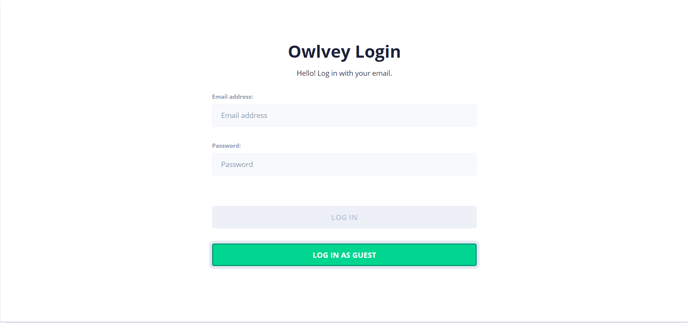
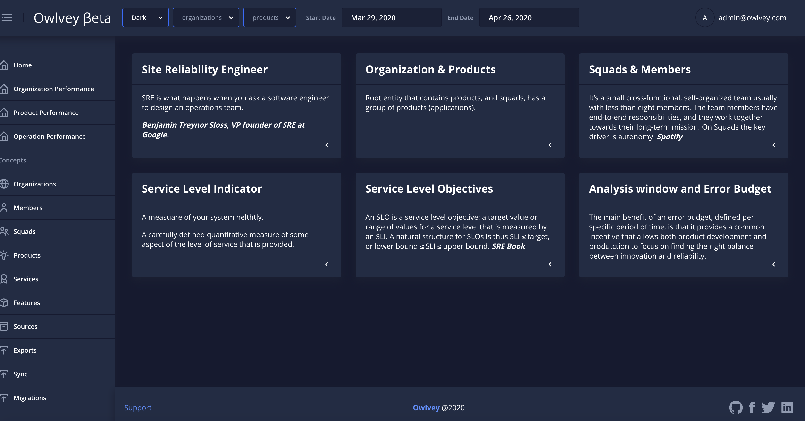

# Instalación y configuración de Docker 


NOTA: Basado en Sistemas Operativos GNU/Linux Centos/RHEL 7.X


## Desinstalación de antiguas versiones

Para esta configuración es bueno tener un espacio limpio de cualquier configuración previa de Docker; para esto lanzaremos el siguiente comando que nos ayudará a esta limpieza.

```
$ sudo yum remove docker \
                  docker-client \
                  docker-client-latest \
                  docker-common \
                  docker-latest \
                  docker-latest-logrotate \
                  docker-logrotate \
                  docker-engine
```

## Instalación del motor de Docker

2.1. Instalación desde el repositorio
Una Instalación limpia de Docker desde el repositorio necesita que instalemos unos paquetes (yum-utils, yum-config-manager, device-mapper-persistent-data, lvm2) previos necesarios para un correcto funcionamiento de Docker

```
$ sudo yum install -y yum-utils \
  device-mapper-persistent-data \
  lvm2
```

Ahora procederemos a configurar un repositorio estable para la descarga e instalación de Docker:

```
$ sudo yum-config-manager \
    --add-repo \
    https://download.docker.com/linux/centos/docker-ce.repo
```

Por último, se procede a la instalación de Docker Engine:

```
$ sudo yum install docker-ce docker-ce-cli containerd.io
```

## Instalación manual

Si no se ha podido instalar desde el repositorio, es posible hacerlo desde la forma manual siguiendo las siguientes instrucciones:

Primero iremos al siguiente sitio: https://download.docker.com/linux/centos/7/x86_64/stable/Packages/ en donde encontraremos las versiones estables de Docker Engine para sistemas Linux Centos 7, descargaremos containerd.io , docker-ce y docker-ce-cli e instalaremos cada uno de ellos de la siguiente forma:

```
$ sudo yum install /path/to/package.rpm
```

## Desinstalación de Docker Nginx

Para desinstalar Docker Engine, se procede con el siguiente comando:

```
$ sudo yum remove docker-ce
```

Por último, se procederá a la eliminación de todos los archivos residuales de Docker:

```
$ sudo rm -rf /var/lib/docker
```

## Configuración básica de Docker

Primero, para que un usuario no root pueda administrar los contenedores de Docker, se procederá a configurar los privilegios, además de asignarlo para que pueda administrar Docker con los siguientes pasos:

```
$ sudo groupadd docker
$ sudo usermod -aG docker dfrunner
$ newgrp docker
```

Ahora, se procede a iniciar Docker y habilitarlo para que se arranque junto con el sistema:

```
$ sudo systemctl start docker
$ sudo systemctl enable docker
```

Si estás detras de un proxy, es necesario configurar el proxy para Docker con las siguientes instrucciones: Primero, se crea un folder de configuración y luego, se crea el archivo que contendrá la configuración del proxy:

```
$ sudo mkdir -p /etc/systemd/system/docker.service.d
$ sudo vim /etc/systemd/system/docker.service.d/http-proxy.conf
```

El siguiente paso es agregar dentro de ese archivo la siguiente documentación:

```
/etc/systemd/system/docker.service.d/http-proxy.conf
```
```
[Service]   
Environment="HTTP_PROXY=http://DOMINIO_PROXY:PUERTO_PROXY" "NO_PROXY=localhost,127.0.0.1"
```

Para que tome estos cambios en el servidor los servicios, se debe recargar el demonio de servicios del sistema con el siguiente comando:

```
$ sudo systemctl daemon-reload
```

Posteriormente, reiniciamos el servicio de Docker:

```
$ sudo systemctl restart docker
```

Se verifica que el proxy haya quedado correctamente asignado con el siguiente comando:

```
$ systemctl show --property=Environment docker
```

## Docker Registry y configuración de docker-compose

Ahora, en este nuevo punto, procederemos a desplegar un Docker-Registry que nos funcionará de repositorio para almacenar nuestras imágenes de Docker:


```
$ docker run -d -p 10000:5000 --restart=always --name registry registry:2
```

Se descarga la imágenes oficiales en docker hub (e. g. https://hub.docker.com/r/owlvey/api) de Owlvey de la siguiente forma:

```
$ docker pull owlvey/api
$ docker pull owlvey/site
$ docker pull owlvey/relational
$ docker pull owlvey/authority
$ docker pull owlvey/notifications
$ docker pull owlvey/worker
```

En este punto, si no se es posible descargar las imágenes oficiales desde el DockerHub como se indica en los 2 puntos anteriores, entonces se debe efectuar los siguientes pasos:

```
$ scp -rp USUARIO_SSH@IP_SERVIDOR_DESTINO:/usr/owlvey/images ./images
```

Luego, se importa el Docker Engine local con los siguientes comandos:

```
$ docker load --input registry.tar
$ docker load --input owlvey_api.tar
$ docker load --input owlvey_authority.tar
$ docker load --input owlvey_notifications.tar
$ docker load --input owlvey_relational.tar
$ docker load --input owlvey_worker.tar
$ docker load --input owlvey_site.tar
```

Despues de importar la imágenes, se procederá a arrancar el docker-registry local:

```
$ docker run -d -p 10000:5000 --restart=always --name registry registry:2
```

Después de tener nuestras imágenes importadas a nuestro Docker Engine local, se procede a tagguear las imágenes locales y subirlas al Registry local (el siguiente comando será sólo un ejemplo y se entenderá que se deberá realizar con cada una de nuestras imágenes exceptuando registry)

```
$ docker image tag owlvey/api localhost:10000/owlvey-api
$ docker push localhost:10000/owlvey-api
```

Por último, se modifica el docker-compose para que quede similar al siguiente, modificando los nombres de las imágenes para que hagan referencia a las guardadas en registry local (NOTA: Descargar esta vesión versionada de docker-compose github de Owlvey https://bitbucket.agile.bns/projects/CODFDEVOPS/repos/olwvey_docker_github_version/browse)

```
/usr/owlvey/owlvey_docker/docker-compose.yml
```
```
version: "3"
services:
    db:
        image: "localhost:10000/owlvey-relational:latest"
        environment:
            SA_PASSWORD: "TheFalcon123"
            ACCEPT_EULA: "Y"
            ASPNETCORE_ENVIRONMENT: "docker"
            MSSQL_PID: "Express"
        ports:
            - "45004:1433"
        depends_on:
            - authority
        networks:
            - owlvey-net
    authority:
        image: "localhost:10000/owlvey-authority:latest"
        environment:
            ASPNETCORE_ENVIRONMENT: "docker"
            Authentication__User: "admin@owlvey.com"
            Authentication__Password: "0wlv3y@"
            Authentication__Email: "admin@owlvey.com"
        ports:
            - "45002:80"
        networks:
            - owlvey-net
    api:
        image: "localhost:10000/owlvey-api:latest"
        environment:
            ASPNETCORE_ENVIRONMENT: "docker"
            Authentication__Authority: "http://${OWLVEY_HOST}:45002"
            Settings__Api: "http://${OWLVEY_HOST}:45001"
        ports:
            - "45001:80"
        networks:
            - owlvey-net
        depends_on:
            - db
            - authority
 
    internal_api:
        image: "localhost:10000/owlvey-api:latest"
        environment:
            ASPNETCORE_ENVIRONMENT: "docker"
            Authentication__Authority: "http://authority:80"
            Settings__Api: "http://internal_api:80"
        ports:
            - "45006:80"
        networks:
            - owlvey-net
        depends_on:
            - db
            - authority
 
    site:
        image: "localhost:10000/owlvey-site:latest"
        environment:
            ASPNETCORE_ENVIRONMENT: "docker"
        ports:
            - "10001:80"
        networks:
            - owlvey-net
 
    notification:
        image: "localhost:10000/owlvey-notifications:latest"
        environment:
            owlvey_slack_key: "console"
            falcon_https_proxy: ""
            falcon_http_proxy: ""
        ports:
            - "45003:45003"
        depends_on:
            - authority
            - db
            - api
            - site
        networks:
            - owlvey-net
 
    worker:
        image: "localhost:10000/owlvey-worker:latest"
        environment:
            owlvey_notification_api: "http://notification:45003"
            owlvey_api: "http://internal_api:80"
            owlvey_site: "http://site:80"
            owlvey_identity: "http://authority:80"
            owlvey_client_id: "CF4A9ED44148438A99919FF285D8B48D"
            owlvey_secret_key: "0da45603-282a-4fa6-a20b-2d4c3f2a2127"
        depends_on:
            - notification
        networks:
            - owlvey-net
 
networks:
  owlvey-net:
    external: false

```


## Puesta en marcha

Nos ubicamos en la siguiente carpeta y creamos un archivo llamado ```start.bash```:

```
$ cd /usr/owlvey/owlvey_docker/
$ sudo vim start.bash
```
```
NOTA:
Y ahí  es en donde escribiremos los siguientes comandos teniendo en cuenta que OWLVEY_HOST debe tener la IP de la máquina en donde se están desplegando los contenedores
```

```
/usr//owlvey/owlvey_docker/start.bash
```
```
#!/bin/bash
export OWLVEY_HOST=192.168.0.4
docker-compose down
docker-compose pull
docker-compose up -d
```


Y luego, se suben los contenedores desde el archivo ```start.bash```:

```
$ sh start.bash
```

## Pruebas

Se valida que owlvey esté ne funcionamiento realizando las siguientes pruebas.

1. Colocar en el navegador web lo siguiente:

```
http://192.168.0.4:45000/
```

o con tu IP que tienes asignada por DHCP:

```
http://IP_ASIGNADA:45000/
```

2. Debes observar algo como:



3. Ingresas los siguientes datos en los campos respectivos:

```
Email address: admin@owlvey.com
Password: 0wlv3y@
```

4. Debes ver el dashboard:



5. Listo, puedes iniciar a trabajar cono Owlvey! :D